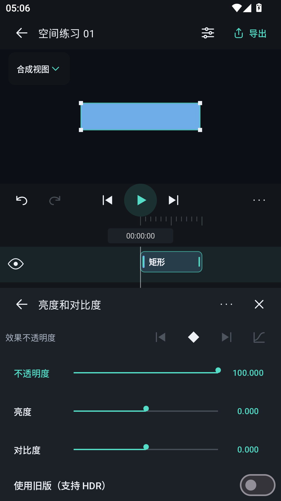
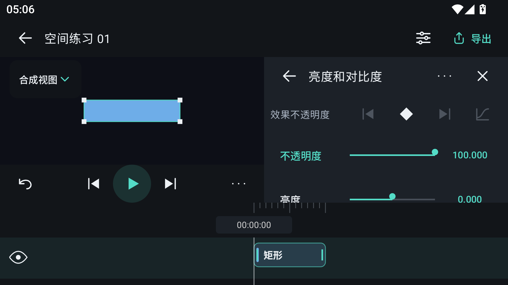
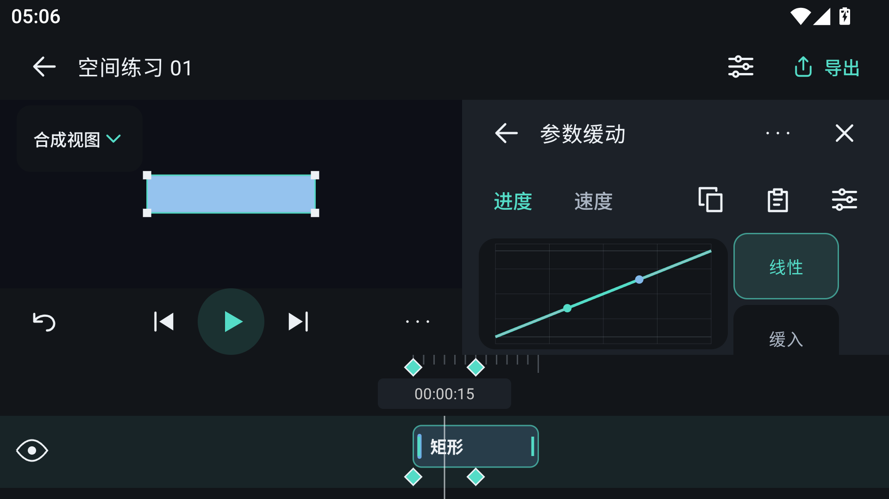

# 效果属性与时间轴布局

原效果属性区覆盖图层时间轴，调参数时难以对照片段位置。现在效果编辑使用独立布局，预览、播放控制、当前图层时间轴和参数区同时显示。

## 操作

- 竖屏：预览、播放控制、当前图层时间轴、效果面板依次排列。
- 横屏：预览与效果面板左右排列，当前图层时间轴位于底部。
- 添加效果、编辑参数、颜色曲线和缓动曲线均保留时间轴。关闭效果后恢复完整图层时间轴。
- 点击参数名称选择当前参数；拖动滑条实时预览，点击数值精确输入。大字体增加参数行高度，长列表可滚动。
- 当前参数共用上一关键帧、添加/删除关键帧、下一关键帧和缓动工具。参数区不再重复显示时间滑条、关键帧列表与播放按钮。
- 拖动时间轴更新当前帧、参数采样值和预览。长按关键帧可复制、移动或删除；已占用或超出合成范围的目标帧不能提交。
- 当前图层时间轴保留片段移动与裁剪；完整时间轴提供图层排序，避免单图层模式误改层级。
- 缓动曲线保留小圆点和对应连接线。较矮的横屏区域把预设移至图形右侧，保留曲线操作空间。
- 效果说明、兼容信息与版本切换放在更多菜单中；切换版本前明确告知参数及关键帧重置。

## 实际界面

截图来自专用 Android 15 模拟器，分别调整窗口尺寸、显示密度和系统字体后采集。

## 验证

28 项 Android 前端回归通过，覆盖效果链、参数拖动与撤销、时间轴寻帧、效果关键帧复制/移动/删除、曲线控制柄、独立坐标轴、片段编辑、普通属性面板和音视频导入与播放。六组布局验收通过，覆盖添加目录、参数和缓动编辑，并检查预览、时间轴、参数及播放区不重叠。33 个矢量图标生成检查一致。

| 实际窗口 | 字体倍率 |
| --- | --- |
| 320 × 569 dp 竖屏 | 1.0 |
| 360 × 640 dp 竖屏 | 1.3、1.8 |
| 411 × 731 dp 竖屏 | 1.0 |
| 640 × 360 dp 横屏 | 1.0、1.3 |

原生引擎及其接口未修改。安装包包含两种 ABI，其原生库与已合入主分支的验收安装包逐字节一致。本次运行设备为 Android 15 x86_64 模拟器，尚未进行实体设备验收。

复现：Gradle `assembleDebug assembleDebugAndroidTest`；Android instrumentation 测试类 `IntegratedFrontendTest`、`FrontendLayerControlsTest`、`PropertyOverlayTest`、`CurveEditingTest`；`python tools/validate_layout_profiles.py --serial <设备序列号> --suite integrated --output <证据目录>`；`python tools/generate_editor_icons.py --check`。

本地构建日志、测试日志、六组窗口截图和安装包校验值保存在 `artifacts/effects-timeline/`。此前集成记录见 [PR #7–#12 验收](pr7-12-acceptance.md)。
