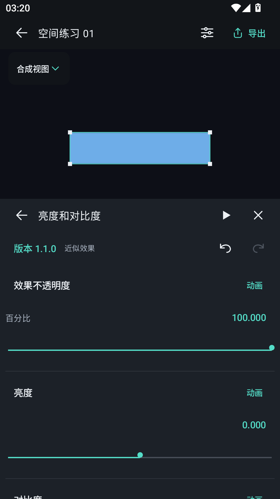
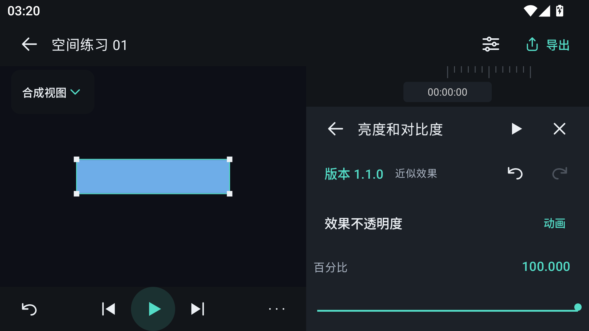

# PR #7–#12 前端接入与验收

本次在独立目录和 `codex/pr7-12-ui-integration` 分支集成六个 PR，并补齐效果、音频、视频的生产界面。保留各原始分支的提交历史，通过一个集成 PR 合入主分支。

| PR | 后端能力 | 当前界面 |
| --- | --- | --- |
| #7 | 默认二维、显式三维与平面遮挡 | 图层默认二维，主动开启三维后显示 Z 和三维旋转控制 |
| #8 | 图层与片段编辑、分离轨道 | 图层排序、片段移动/裁剪/拆分/复制、X/Y/Z 独立属性与缓动曲线 |
| #9、#11 | 插件、36 种效果及参数动画 | 效果目录、效果链排序/复制/删除/启用、参数、关键帧、缓动和五通道颜色曲线；插件安装与版本管理 |
| #10 | 音频导入、波形及混音 | 系统文件导入、真实波形、音量/静音、播放和导出音轨 |
| #12 | 视频导入、取帧和原声 | 系统文件导入、保留原声选项、动态视频预览及带声音的视频导出 |

## 效果属性区

效果编辑与普通属性共用编辑器内的属性区。竖屏位于底部，横屏位于右侧，不加遮罩；预览保持可见，打开属性时不改变渲染 Surface 的尺寸。面板内提供播放/暂停、返回、关闭、撤销和重做。参数、缓动曲线、颜色曲线在同一区域切换。

滑条采用细线与小圆点，曲线保留对应类型所需的控制柄和连接线，视觉圆点与触摸区域独立。列表及参数可滚动，按钮保持至少 48 dp 的操作空间。

## 同步修正

- 效果渲染计划统一为版本 2，并携带分割后的顶点与绘制批次，使预览与导出的交叉三维平面维持相同遮挡关系。
- 视频导出使用冻结素材逐帧上传，音频使用冻结混音；取消或失败后释放资源及临时文件。
- 音频编码补偿起始延迟并补齐编码尾部，保留精确合成时长；软件视频编码器使用匹配的颜色标记。
- 工程恢复时检查音视频缓存，并提供重建进度、取消、错误与重试反馈。
- 修正旧工程效果格式迁移、已保存插件版本的精确定位和曲线查找，避免静默更换版本。

## 验证

| 检查 | 结果 |
| --- | --- |
| Rust 工作区测试 | 98 通过，1 项原有忽略测试 |
| Android 前端交互 | 18 通过 |
| Android 效果、正交预览和几何导出 | 9 通过 |
| Android 音视频接口 | 11 通过 |
| 实际窗口布局 | 6 个模拟器尺寸/字体配置通过，结束后恢复设备设置 |
| 矢量图标生成检查 | 33 个图标一致 |
| Android 原生构建 | arm64-v8a、x86_64 两种 ABI |

窗口配置包括 320/360/411 dp 竖屏，640×360 dp 横屏，以及 1.3、1.8 倍字体。截图来自实际运行界面。

导出验证对两秒测试素材进行独立解码：60 个视频帧、48 kHz 双声道共 96,000 个采样，音视频均从零开始且时长为两秒；声音活动窗口与缓存一致，四个时间点的画面颜色与源视频各通道误差不超过 3/255。

设备验证使用专用 Android 15 x86_64 模拟器，arm64 仅完成构建，尚未进行实体设备验收。混合运行界面与无界面渲染测试的一次批量执行超时，最终按独立测试组验证；连续播放中的暂停操作使用系统触摸测试，避免等待不断刷新的界面进入空闲状态。

## 范围与接口限制

本次仅覆盖 #7–#12，不包含后续表达式 PR、模型导入、合成或预渲染。后端没有提供将已分离的 XYZ 轨道重新合并的命令：可撤销当前分离操作，已保存独立轨道的合并仍需补充接口。视频和纯音频图层的效果入口按当前后端支持范围显示。

验收命令：`cargo test --workspace --offline --locked -j1`、Gradle `assembleDebug assembleDebugAndroidTest`、对应 Android instrumentation 测试类，以及 `tools/validate_layout_profiles.py --suite integrated`。原始日志、每组截图、导出文件及解码报告保存在工作区 `artifacts/pr7-12-*`。
